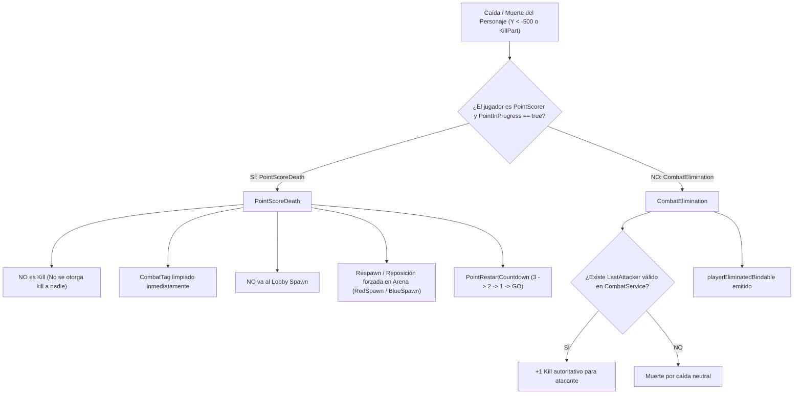

# Slap Duels 2.0 — CHARACTER_LIFECYCLE

> Este documento conserva contenido del `GAME_SDD.md` original suministrado, redistribuido por dominio para reducir el contexto necesario para agentes de IA.

## 15. Point Score Death / Match Character Lifecycle

### 15.1 Distinción Arquitectónica Fundamental: PointScoreDeath vs CombatElimination
En *Slap Duels 2.0*, la muerte física de un personaje durante una partida activa puede deberse a dos causas completamente distintas que requieren flujos y consecuencias aisladas:

| Aspecto | PointScoreDeath | CombatElimination |
| :--- | :--- | :--- |
| **Causa física** | Jugador atraviesa `RedWin` o `BlueWin` y cae al vacío como consecuencia de anotar el punto. | Jugador es golpeado por un slap y lanzado fuera de la plataforma o hacia `KillPart`. |
| **Atribución de Kill** | **NULA.** No se otorga kill al oponente bajo ninguna circunstancia, incluso si hubo un golpe reciente. | **SÍ.** Se otorga `+1 Kill` al último atacante válido (`LastAttacker`) dentro de la ventana de vida (`LastHitLifetime`). |
| **Registro de Eliminación** | **Ignorado.** No se emite `playerEliminatedBindable` ni se incrementa contador de bajas/muertes. | **Procesado.** Se registra en `EliminationService` y se notifica al sistema de estadísticas. |
| **Destino de Respawn** | **Arena Spawn correspondiente (`RedSpawn` / `BlueSpawn`).** El jugador jamás sale del match. | **Arena Spawn (si continúa) o Lobby (si concluye partida).** |
| **Impacto en Match** | La partida continúa fluidamente hacia `PointRestartCountdown` (3 → 2 → 1 → GO). | La partida continúa fluidamente o concluye si se alcanza condición de victoria. |

### 15.2 PointScorer y MatchId Isolation
Para prevenir contaminación entre partidas simultáneas y desincronización de estados:
1. **Atribución Atómica por Match:** El estado de punto se almacena estrictamente a nivel de instancia dentro de `MatchSession` en `RoundService` e indexado por `MatchId` en `ScoreService`:
   - `session.PointInProgress`: Booleano que bloquea la duplicidad de puntos y marca el intervalo de reinicio.
   - `session.PointScorer`: Referencia directa al `Player` que acaba de marcar el punto.
   - `session.PointScorerTeam`: Equipo (`Red` | `Blue`) del anotador.
   - `session.PointScoreTimestamp`: Marca de tiempo de la anotación (`os.clock()`).
   - `session.PointNumber`: Número total de puntos anotados en la partida.
2. **Aislamiento Total:** El `PointScorer` de `Match A` jamás influye ni modifica la resolución de combate o muertes en `Match B`. Cada sesión evalúa de forma independiente a sus propios participantes.
3. **Limpieza Autoritativa:** Cuando el flujo de punto concluye y la partida regresa al estado `Playing` (al llegar a "GO" tras la cuenta de 3 segundos), `ScoreService:ResumeScoring(matchId)` y `RoundService` limpian atómicamente todos los campos de `PointScorer`.

### 15.3 Control Autoritativo del Character Lifecycle durante el Match
Durante una partida, el motor de la partida (`RoundService` y `SpawnService`) mantiene el control absoluto sobre el ciclo de vida del personaje:
- **`SpawnService:StartMatchRespawnTracking(session)`:** Escucha los eventos `player.CharacterAdded` de ambos contendientes. La reposición en la arena está habilitada para los estados activos:
  - `Playing`
  - `PointRestartCountdown`
  - `StartCountdown`
- **Inmunidad al Respawn del Lobby:** Si el personaje cae al vacío y es destruido por `workspace.FallenPartsDestroyHeight` (-500) o por el auto-load de Roblox, `SpawnService` intercepta el `CharacterAdded` en el mismo frame y teletransporta de inmediato al jugador a su spawn de arena (`RedSpawn` o `BlueSpawn`), con velocidad cero, sin ragdoll y con su herramienta Slap re-equipada.
- **Reconstitución Inmediata (`EnsureCharacter` / `TeleportCharacterToSpawn`):** Si al momento de reposicionar a los jugadores (`SpawnMatchPlayers`) el personaje del anotador se encuentra muerto (`Humanoid.Health <= 0`), destruido o cayendo a gran profundidad en el vacío, el servidor invoca forzosamente `player:LoadCharacter()`, reviviendo al personaje de inmediato sin esperar el retraso pasivo (`RespawnTime = 3s`) del motor de Roblox.

### 15.4 Interacción con PointRestartCountdown y Victoria Inmediata
- **Punto Intermedio (< WinningScore):**
  1. Jugador anota (+1 Score, +50 Coins, `PointScorer` registrado).
  2. Presentación audiovisual (`PointFeedbackService`).
  3. Reposición de ambos contendientes en arena (`SpawnMatchPlayers`).
  4. Cuenta regresiva 3 → 2 → 1 → GO (`PointRestartCountdown`).
  5. Transición a `Playing` y reanudación de scoring / combate normal (`ResumeScoring`).
- **Punto Final / Victoria Inmediata (WinningScore = 5):**
  1. Jugador anota el 5to punto.
  2. `ScoreService` detecta `score[team] >= winningScore`.
  3. Invoca inmediatamente `roundService:DeclareWinner(team)`.
  4. **NO** se inicia `PointRestartCountdown`, **NO** se realiza respawn innecesario en arena.
  5. La partida avanza directamente hacia `Ending` (presentación de victoria) y `ReturningToLobby`.
  6. Si el ganador cae al vacío tras anotar el punto de victoria, su muerte es igualmente tratada como `PointScoreDeath`, impidiendo cualquier atribución de Kill errónea al perdedor.

### 15.5 Infraestructura Zero-Death — Fase 1 (VoidBoundary + Match Identity)
Como preparación para el modelo de reposicionamiento sin muerte (Zero-Death / Persistent Character), se incorporan los siguientes componentes de infraestructura base:
1. **`VoidBoundaryPart` por MatchInstance:**
   - Cada arena clonada crea automáticamente una instancia `Part` llamada `VoidBoundaryPart` contenida dentro de `Workspace.ActiveMatches.Match_<Id>`.
   - Dimensiones configuradas en `Config.Arena.VoidBoundarySize` (por defecto `Vector3.new(500, 4, 500)`) y posición desplazada según `Config.Arena.VoidBoundaryOffset` (por defecto `(0, -50, 0)` respecto al `Origin` de la arena).
   - Propiedades: `Anchored = true`, `CanCollide = false`, `CanTouch = true`, `CanQuery = false`, `Transparency = 1`.
   - Aislamiento: Se destruye automáticamente al finalizar el match mediante `MatchInstanceService:DestroyInstance`.
   - *Nota de Fase 1:* No posee listeners activos de `Touched` ni interrumpe el gameplay actual; actúa únicamente como volumen físico preparado para fases posteriores.
2. **Identidad Server-Authoritative (`MatchId` y `MatchTeam`):**
   - Asignación: Al alcanzar el estado `MatchReady` en `RoundService`, a cada jugador contendiente se le asignan los atributos:
     - `player:SetAttribute("MatchId", session.Id)`
     - `player:SetAttribute("MatchTeam", "Red" | "Blue")`
   - Limpieza: Los atributos se restablecen a `nil` de forma garantizada en:
     - `_cleanupSession` (al concluir `ReturningToLobby` hacia `Waiting`).
     - `_cancelSession` (ante cancelaciones imprevistas o abortos de match).
     - `_handlePlayerLeaving` (cuando un jugador abandona el servidor vía `PlayerRemoving`).
