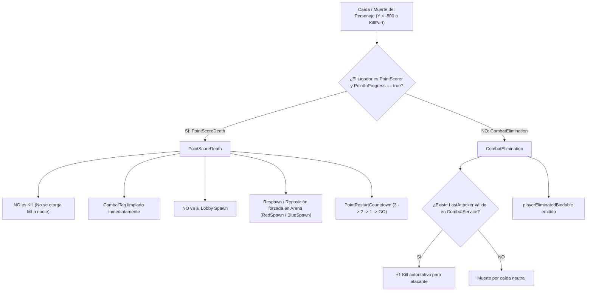

# Slap Duels 2.0 — CHARACTER_LIFECYCLE

> Este documento conserva contenido del `GAME_SDD.md` original suministrado, redistribuido por dominio para reducir el contexto necesario para agentes de IA.

## 15. Point Score Death / Match Character Lifecycle

### 15.1 Distinción Arquitectónica Fundamental: PointScoreDeath vs CombatElimination
En *Slap Duels 2.0*, la muerte física de un personaje durante una partida activa puede deberse a dos causas completamente distintas que requieren flujos y consecuencias aisladas:

| Aspecto | PointScoreDeath | CombatElimination |
| :--- | :--- | :--- |
| **Causa física** | Jugador atraviesa `RedWin` o `BlueWin` y cae al vacío como consecuencia de anotar el punto. | Jugador es golpeado por un slap y lanzado fuera de la plataforma o hacia `KillPart`. |
| **Atribución de Kill** | **NULA.** No se otorga kill al oponente bajo ninguna circunstancia, incluso si hubo un golpe reciente. | **SÍ.** Se otorga `+1 Kill` al último atacante válido (`LastAttacker`) dentro de la ventana de vida (`LastHitLifetime`). |
| **Registro de Eliminación** | **Ignorado.** No se emite `playerEliminatedBindable` ni se incrementa contador de bajas/muertes. | **Procesado.** Se registra en `EliminationService` y se notifica al sistema de estadísticas. |
| **Destino de Respawn** | **Arena Spawn correspondiente (`RedSpawn` / `BlueSpawn`).** El jugador jamás sale del match. | **Arena Spawn (si continúa) o Lobby (si concluye partida).** |
| **Impacto en Match** | La partida continúa fluidamente hacia `PointRestartCountdown` (3 → 2 → 1 → GO). | La partida continúa fluidamente o concluye si se alcanza condición de victoria. |

### 15.2 PointScorer y MatchId Isolation
Para prevenir contaminación entre partidas simultáneas y desincronización de estados:
1. **Atribución Atómica por Match:** El estado de punto se almacena estrictamente a nivel de instancia dentro de `MatchSession` en `RoundService` e indexado por `MatchId` en `ScoreService`:
   - `session.PointInProgress`: Booleano que bloquea la duplicidad de puntos y marca el intervalo de reinicio.
   - `session.PointScorer`: Referencia directa al `Player` que acaba de marcar el punto.
   - `session.PointScorerTeam`: Equipo (`Red` | `Blue`) del anotador.
   - `session.PointScoreTimestamp`: Marca de tiempo de la anotación (`os.clock()`).
   - `session.PointNumber`: Número total de puntos anotados en la partida.
2. **Aislamiento Total:** El `PointScorer` de `Match A` jamás influye ni modifica la resolución de combate o muertes en `Match B`. Cada sesión evalúa de forma independiente a sus propios participantes.
3. **Limpieza Autoritativa:** Cuando el flujo de punto concluye y la partida regresa al estado `Playing` (al llegar a "GO" tras la cuenta de 3 segundos), `ScoreService:ResumeScoring(matchId)` y `RoundService` limpian atómicamente todos los campos de `PointScorer`.

### 15.3 Control Autoritativo del Character Lifecycle durante el Match
Durante una partida, el motor de la partida (`RoundService` y `SpawnService`) mantiene el control absoluto sobre el ciclo de vida del personaje:
- **`SpawnService:StartMatchRespawnTracking(session)`:** Escucha los eventos `player.CharacterAdded` de ambos contendientes. La reposición en la arena está habilitada para los estados activos:
  - `Playing`
  - `PointRestartCountdown`
  - `StartCountdown`
- **Inmunidad al Respawn del Lobby:** Si el personaje cae al vacío y es destruido por `workspace.FallenPartsDestroyHeight` (-500) o por el auto-load de Roblox, `SpawnService` intercepta el `CharacterAdded` en el mismo frame y teletransporta de inmediato al jugador a su spawn de arena (`RedSpawn` o `BlueSpawn`), con velocidad cero, sin ragdoll y con su herramienta Slap re-equipada.
- **Reconstitución Inmediata (`EnsureCharacter` / `TeleportCharacterToSpawn`):** Si al momento de reposicionar a los jugadores (`SpawnMatchPlayers`) el personaje del anotador se encuentra muerto (`Humanoid.Health <= 0`), destruido o cayendo a gran profundidad en el vacío, el servidor invoca forzosamente `player:LoadCharacter()`, reviviendo al personaje de inmediato sin esperar el retraso pasivo (`RespawnTime = 3s`) del motor de Roblox.

### 15.4 Interacción con PointRestartCountdown y Victoria Inmediata
- **Punto Intermedio (< WinningScore):**
  1. Jugador anota (+1 Score, +50 Coins, `PointScorer` registrado).
  2. Presentación audiovisual (`PointFeedbackService`).
  3. Reposición de ambos contendientes en arena (`SpawnMatchPlayers`).
  4. Cuenta regresiva 3 → 2 → 1 → GO (`PointRestartCountdown`).
  5. Transición a `Playing` y reanudación de scoring / combate normal (`ResumeScoring`).
- **Punto Final / Victoria Inmediata (WinningScore = 5):**
  1. Jugador anota el 5to punto.
  2. `ScoreService` detecta `score[team] >= winningScore`.
  3. Invoca inmediatamente `roundService:DeclareWinner(team)`.
  4. **NO** se inicia `PointRestartCountdown`, **NO** se realiza respawn innecesario en arena.
  5. La partida avanza directamente hacia `Ending` (presentación de victoria) y `ReturningToLobby`.
  6. Si el ganador cae al vacío tras anotar el punto de victoria, su muerte es igualmente tratada como `PointScoreDeath`, impidiendo cualquier atribución de Kill errónea al perdedor.

### 15.5 Infraestructura Zero-Death — Fase 1 (VoidBoundary + Match Identity)
Como preparación para el modelo de reposicionamiento sin muerte (Zero-Death / Persistent Character), se incorporan los siguientes componentes de infraestructura base:
1. **`VoidBoundaryPart` por MatchInstance:**
   - Cada arena clonada crea automáticamente una instancia `Part` llamada `VoidBoundaryPart` contenida dentro de `Workspace.ActiveMatches.Match_<Id>`.
   - Dimensiones configuradas en `Config.Arena.VoidBoundarySize` (por defecto `Vector3.new(500, 4, 500)`) y posición desplazada según `Config.Arena.VoidBoundaryOffset` (por defecto `(0, -50, 0)` respecto al `Origin` de la arena).
   - Propiedades: `Anchored = true`, `CanCollide = false`, `CanTouch = true`, `CanQuery = false`, `Transparency = 1`.
   - Aislamiento: Se destruye automáticamente al finalizar el match mediante `MatchInstanceService:DestroyInstance`.
   - *Nota de Fase 1:* No posee listeners activos de `Touched` ni interrumpe el gameplay actual; actúa únicamente como volumen físico preparado para fases posteriores.
2. **Identidad Server-Authoritative (`MatchId` y `MatchTeam`):**
   - Asignación: Al alcanzar el estado `MatchReady` en `RoundService`, a cada jugador contendiente se le asignan los atributos:
     - `player:SetAttribute("MatchId", session.Id)`
     - `player:SetAttribute("MatchTeam", "Red" | "Blue")`
   - Limpieza: Los atributos se restablecen a `nil` de forma garantizada en:
     - `_cleanupSession` (al concluir `ReturningToLobby` hacia `Waiting`).
     - `_cancelSession` (ante cancelaciones imprevistas o abortos de match).
     - `_handlePlayerLeaving` (cuando un jugador abandona el servidor vía `PlayerRemoving`).

### 15.6 Infraestructura Zero-Death — Fase 2 (Ragdoll Reset + Persistent Character Reposition)
En esta fase se incorporan las APIs autoritativas de restauración y reposicionamiento físico sobre el mismo `Character` sin recargas ni regeneraciones:
1. **`RagdollService:ResetRagdollImmediate(character: Model): boolean`:**
   - Reseteo forzado, síncrono e idempotente del estado de muñeco de trapo.
   - Cancela de inmediato cualquier timer activo en `_activeTimers[character]`, evitando callbacks diferidos posteriores.
   - Reactiva articulaciones (`AnimationConstraint` en R15 o `Motor6D`/`RootJoint` en R6).
   - Destruye soldaduras o partes colisionadoras temporales asociadas a R6.
   - Restablece el `Humanoid` (`PlatformStand = false`, `AutoRotate = true`, `GettingUp`).
   - Anula `AssemblyLinearVelocity` y `AssemblyAngularVelocity` en todas las partes del modelo.
   - Emite señal al cliente para apagar `RagdollStatesHandler`.
   - **Garantía:** No mata al `Humanoid`, no toca `Health` y no reemplaza el `Character`.
2. **`SpawnService:ResetCharacterInArena(player: Player): boolean`:**
   - Reposiciona el modelo existente del avatar dentro de su arena correspondiente.
   - Resuelve el spawn físico (`RedSpawn` / `BlueSpawn`) consultando exclusivamente los atributos `MatchId` y `MatchTeam` contra `MatchInstanceService:GetInstance(matchId)`, garantizando cero colisiones entre partidas concurrentes.
   - Invoca previamente `RagdollService:ResetRagdollImmediate(character)` para asegurar locomoción inmediata.
   - Limpia velocidades lineales y rotacionales antes y después del reposicionamiento.
   - Mueve el avatar mediante `character:PivotTo()` con elevación de seguridad basada en `HipHeight` y grosor del spawn.
   - **Garantía:** No invoca `player:LoadCharacter()`, no destruye el modelo y preserva exactamente la misma instancia del `Character` del jugador.
   - *Nota de Fase 2:* Esta API queda expuesta como primitiva para las fases subsiguientes. Todavía no está conectada a listeners de `VoidBoundaryPart`, `KillPart`, `Touched` ni `Humanoid.Died`. El ciclo tradicional de respawn sigue operando en paralelo sin interferencias.

### 15.7 Infraestructura Zero-Death — Fase 3A (KillParts como Sensores No Letales)
A partir de esta fase, los `KillPart` dentro de una `MatchSession` dejan de ser letales y pasan a operar como sensores espaciales de salida/eliminación de combate:
1. **No Letalidad de KillPart:**
   - Se elimina la asignación `humanoid.Health = 0` al tocar un KillPart.
   - `Humanoid.Health` permanece intacto (> 0) y no se dispara `Humanoid.Died`.
   - El `Character` existente se preserva en memoria (`player.Character == characterBefore`).
2. **Clasificación Autoritativa (`HandleKillPartTouch`):**
   - **CombatElimination:** Si existe un atacante válido en `CombatService` (`attacker ~= victim`, mismo `MatchId`, TTL $\le 10\text{s}$), se otorga autoritativamente $+1\text{ Kill}$ al atacante vía `PlayerService:AddKill()`, se consume/limpia el `CombatTag` y se reposiciona a la víctima en su base mediante `SpawnService:ResetCharacterInArena(victim)`.
   - **Normal Fall:** Si no hay atacante válido, se clasifica como caída libre sin kill ($+0\text{ Kill}$), se limpia cualquier tag residual y se reposiciona al jugador en su base.
3. **Protección Anti-Duplicate:**
   - Debounce local en `EliminationService._processingEliminations[player]` (ventana de 0.5s) y clave unívoca `MatchId_UserId_CharId` en `_resolvedEliminations`, impidiendo dobles Kills ante impactos multifacéticos simultáneos.
4. **Protección PointInProgress:**
   - Si el jugador que toca el KillPart es el `PointScorer` durante `session.PointInProgress == true`, el evento es absorbido: no genera kill, no produce eliminación y no teletransporta de inmediato al anotador, preservando la cinemática del gol.
5. **Aislamiento Multi-Match:**
   - Se valida que `killPart` sea descendiente directo de `session.InstanceInfo.Container`. Contactos cruzados con arenas ajenas son descartados sin procesamiento.
6. **Compatibilidad:**
   - *Nota de Fase 3A:* `VoidBoundaryPart` quedó preparado para ser activado en la Fase 3B.

### 15.8 Infraestructura Zero-Death — Fase 3B (VoidBoundary + Detección Server-Authoritative de Caída)
En esta fase se completa la detección integral de jugadores que abandonan el volumen jugable de la arena sin depender exclusivamente de colisionar físicamente con un `KillPart`:
1. **Doble Capa de Detección (Touched + Polling Fail-Safe):**
   - **`VoidBoundaryPart.Touched`:** Detecta contactos directos con el volumen no letal del boundary (`HandleVoidBoundaryTouch`).
   - **Polling Fail-Safe (`_pollActiveSessions`):** Loop asíncrono con intervalo configurable (`Config.Arena.VoidBoundaryPollInterval = 0.2s`) que evalúa exclusivamente a los jugadores de partidas activas (`_activeSessions`). Si un avatar atraviesa la geometría por tunneling a alta velocidad y su `HumanoidRootPart.Position.Y <= boundary.Position.Y + (boundary.Size.Y * 0.5)`, se activa la resolución autoritativa de inmediato.
2. **Diferencia Conceptual entre KillPart y VoidBoundary:**
   - **KillPart:** Sensor geométrico ubicado en trampas o zonas intermedias inferiores del mapa.
   - **VoidBoundary:** Sensor perimetral y fail-safe de salida definitiva del volumen jugable de la arena completa.
   - Ambos convergen en el núcleo unificado `EliminationService:_processEliminationEvent`.
3. **Clasificación Unificada (Fall vs CombatElimination):**
   - **CombatElimination:** Atacante válido (`CombatService:GetLastAttacker`), mismo `MatchId`, $TTL \le 10\text{s}$, `attacker ~= victim` $\rightarrow$ otorga $+1\text{ Kill}$ vía `PlayerService:AddKill`, limpia el `CombatTag` y reposiciona al jugador.
   - **Normal Fall:** Caída libre sin atacante válido $\rightarrow$ $+0\text{ Kills}$, limpia cualquier tag residual y reposiciona al jugador.
4. **Mecanismo Anti-Duplicate Compartido:**
   - Lock idempotente por jugador en `_processingEliminations[player]` (ventana de 0.5s) que garantiza que si `Touched` y `Polling` detectan la misma caída simultáneamente, sólo se procesa exactamente una vez.
   - Contadores secuenciales por jugador en `_eliminationCounters[player]` para generar claves `_resolvedEliminations` unívocas por caída sin bloquear futuros derribos en la misma partida.
5. **Comportamiento ante Estados del Lifecycle:**
   - **`PointInProgress`:** Si el jugador detectado en el boundary es el `PointScorer` durante un gol anotado, el evento es absorbido: no otorga Kill rival, no emite eliminación y no reposiciona prematuramente, preservando la cinemática del gol y delegando el retorno a `RoundService:TriggerPointRestart`.
   - **`StartCountdown`:** Si un jugador cae durante la cuenta regresiva previa al inicio de ronda, se reposiciona inmediatamente a su TeamSpawn mediante `ResetCharacterInArena(player)` con $+0\text{ Kills}$, dejándolo listo en su base para el inicio oficial.
   - **`Ending`:** Durante la pantalla de victoria/resultado, los avatares que caigan al vacío son reposicionados en su spawn con $+0\text{ Kills}$, evitando que mueran físicamente o caigan a `FallenPartsDestroyHeight` antes de la transición a `ReturningToLobby`.
6. **Aislamiento Multi-Match y Cleanup:**
   - Comprobación estricta de pertenencia del boundary a `session.InstanceInfo.Container`.
   - Al finalizar la partida (`UnbindMatch`), se desconectan los listeners, se retira la sesión de `_activeSessions`, se apaga el thread de polling si no quedan partidas en el servidor y se limpian las tablas de debounce.
   - Al destruir la instancia (`MatchInstanceService:DestroyInstance`), el contenedor destruye el `VoidBoundaryPart` sin dejar memory leaks.
7. **Estado del Lifecycle y Compatibilidad:**
   - *Nota de Fase 3B:* `VoidBoundaryPart` y fail-safe polling integrados operativamente.

### 15.9 Infraestructura Zero-Death — Fase 4B (Migración Definitiva)
En esta fase se culmina la transición definitiva hacia la arquitectura **Zero-Death / Persistent Character**, erradicando el ciclo reactivo de muerte/respawn en partidas:
1. **Preservación Global de `Players.CharacterAutoLoads = true`:**
   - Se mantiene intacto el valor del motor a nivel global para garantizar el correcto flujo de jugadores en el Lobby (`PlayerAdded`, `Lobby.SpawnLocation`).
   - Está prohibido alterar `CharacterAutoLoads` dinámicamente, garantizando total estabilidad en entornos multijugador concurrentes.
2. **Blindaje de Humanoid durante Match (`Dead State Protection`):**
   - Al posicionar a un avatar en la arena (`SpawnPlayerInMatch` y `ResetCharacterInArena`), se bloquea el estado de muerte mediante:
     `humanoid:SetStateEnabled(Enum.HumanoidStateType.Dead, false)`
   - Al concluir la partida y regresar al Lobby (`ReturnPlayersToLobby`), se restaura autoritativamente el estado normal:
     `humanoid:SetStateEnabled(Enum.HumanoidStateType.Dead, true)`
   - No se utiliza salud infinita (`MaxHealth = math.huge`) como sustituto de la arquitectura física.
3. **Retiro Completo de `StartMatchRespawnTracking`:**
   - Se eliminaron todas las invocaciones a `spawnService:StartMatchRespawnTracking` y `spawnService:StopMatchRespawnTracking` desde `RoundService`.
   - Se retiró el listener de `CharacterAdded` que interceptaba personajes en el Lobby para forzar su rescate a la arena, eliminando la race condition crítica que provocaba recargas infinitas (`LoadCharacter`).
4. **Desacople Estricto de `player:LoadCharacter()`:**
   - En `SpawnService:TeleportCharacterToSpawn`, se implementó la regla autoritativa con guard `IsPlayerInActiveMatch(player)`:
     - **En Match:** Nunca se llama `player:LoadCharacter()`. El rig existente se reutiliza y se espera a que `HumanoidRootPart` esté listo sin recargar el modelo.
     - **En Lobby:** Se permite la llamada de recuperación si el personaje realmente fue destruido.
5. **Migración de `Humanoid.Died` a Modo Diagnóstico Pasivo:**
   - En `EliminationService`, el listener de `hum.Died` ya no otorga Kills, no ejecuta `OnPlayerEliminated`, no altera el marcador de puntos ni desencadena respawns. Emite exclusivamente advertencias diagnósticas pasivas.
   - Las únicas fuentes válidas de eliminación en partida son los sensores no letales: `KillPart`, `VoidBoundary` y `VoidBoundaryPolling`.
6. **Invariante de Persistencia del Character:**
   - Durante todo el transcurso de una `MatchSession` (`StartCountdown` $\rightarrow$ `Playing` $\rightarrow$ `PointRestartCountdown` $\rightarrow$ `Ending` $\rightarrow$ `ReturningToLobby`), el rig del jugador permanece intacto:
     $$\text{characterBefore} == \text{characterAfter}$$
   - Cero destrucción de modelos, cero parpadeos de pantalla en el Lobby y sincronización física limpia de Slaps y animaciones.

### 15.10 Infraestructura Zero-Death — Fase 4D (Fix Definitivo Ending → Lobby)
En esta fase se resuelve la transición crítica entre el punto final de una partida y el retorno seguro al Lobby:
1. **Estabilización Inmediata en `Ending`:**
   - Al alcanzarse la condición de victoria (ej. 5-0) y transicionar a `Ending`, `RoundService` invoca de forma síncrona `SpawnService:ResetCharacterInArena()` para todos los contendientes.
   - Neutraliza inmediatamente el impulso físico del blastzone final (`PointFeedbackService` / `RagdollService:BlastZone`), resetea el ragdoll, anula velocidades residuales (`AssemblyLinearVelocity = Vector3.zero`, `AssemblyAngularVelocity = Vector3.zero`) y reposiciona a los avatares en sus respectivos `TeamSpawns`.
2. **Sensores Físicos Activos durante `Ending`:**
   - `EliminationService:UnbindMatch()` y `CombatService:ClearMatch()` se postergan estrictamente hasta la fase `ReturningToLobby`.
   - `KillPart`, `VoidBoundaryPart` y el polling asíncrono permanecen 100% operativos durante los 4 segundos de `Ending` como red de contención física.
   - Si un jugador cayese durante `Ending`, `EliminationService` procesa el evento como `Normal Fall` sin scoring ($+0\text{ Kills}$, no altera el ganador, no reinicia puntos) y lo reposiciona de inmediato en su `TeamSpawn`.
3. **Retorno Seguro al Lobby (`ReturningToLobby`):**
   - Se transporta al avatar existente mediante `SpawnService:ReturnPlayersToLobby()`.
   - Se limpian velocidades de todas las partes del modelo, se cancelan timers de ragdoll y se reactiva la locomoción (`PlatformStand = false`, `AutoRotate = true`, `Running`).
   - Se restaura `humanoid:SetStateEnabled(Enum.HumanoidStateType.Dead, true)` de manera segura una vez en el Lobby.
   - Se eliminan los atributos `MatchId` y `MatchTeam`.
   - Se desvinculan los sensores y se destruye la instancia física de la arena.
4. **Prohibición Absoluta de `LoadCharacter()`:**
   - `LoadCharacter()` permanece estrictamente prohibido durante la totalidad de la `MatchSession` (incluyendo `Ending`).
   - El mismo `Character` que jugó la partida es el que camina de regreso al Lobby.

