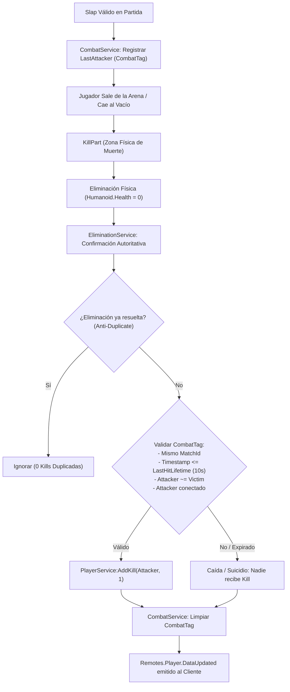

# Slap Duels 2.0 — ELIMINATION

> Este documento conserva contenido del `GAME_SDD.md` original suministrado, redistribuido por dominio para reducir el contexto necesario para agentes de IA.

## 11. Kills / Elimination Attribution

### 11.1 Definición y Principio Fundamental
Una **Kill** representa autoritativamente que un jugador provocó la eliminación física de un oponente durante una partida activa en estado `Playing`.

> [!IMPORTANT]
> **REGLA MANDATORIA: KILL != POINT**
> - **Kill:** Ocurre cuando un jugador golpea a otro y este es eliminado (ej. al caer en `KillPart` o vaciarse su salud). Otorga `+1 Kill` al último atacante válido. **NO otorga Point**.
> - **Point:** Ocurre cuando un jugador ingresa y anota en la zona de meta correspondiente (`ZoneWin`). Otorga `+1 Point` y monedas. **NO otorga Kill**.
> Ambos sistemas son **100% independientes** y responden a servicios distintos (`EliminationService` vs `ScoreService`).

### 11.2 Cadena y Flujo de Eliminación


### 11.3 El Último Atacante y CombatTag (`CombatService`)
- **Responsabilidad Centralizada:** Ningún script de arma o slap administra kills directamente. Los slaps invocan `CombatService:RegisterHit(attacker, victim)`.
- **Estructura del Tag:**
  ```luau
  export type CombatTag = {
      Victim: Player,
      Attacker: Player,
      MatchId: string,
      Timestamp: number,
      HitId: string?,
  }
  ```
- **Regla del Último Golpe:** Si A golpea a B, y luego C golpea a B antes de caer: **C recibe la Kill**, no A.
- **Ventana de Expiración (`LastHitLifetime`):**
  - Configurado en `Config.Combat.LastHitLifetime = 10` (segundos).
  - Si la víctima sobrevive más de 10 segundos tras el último golpe antes de caer o morir, el tag expira y nadie recibe la Kill por ese impacto antiguo.
- **Aislamiento por MatchId:**
  - El sistema exige `attacker.MatchId == victim.MatchId`. Un golpe fuera de partida o asociado a otra arena jamás genera Kill metadata.

### 11.4 KillPart y Detección de Muerte (`EliminationService`)
- **Zona Física `KillPart`:** Cada mapa instanciado contiene una `KillPart` situada debajo de la arena (`Y = -25`).
- Al contactar `KillPart`:
  - Se valida pertenencia al match.
  - Provoca la muerte física del Humanoid (`Health = 0`).
  - Dispara `EliminationService:OnPlayerEliminated(player, "KillPart", matchId)`.
- **Doble Listener Seguro:** Además de `KillPart.Touched`, escucha `Humanoid.Died` para atrapar muertes por cualquier vía.

### 11.5 Protección Anti-Duplicados (Anti-Duplicate Guarantee)
- Una eliminación genera **exactamente 1 Kill como máximo**.
- Cada evento construye una clave atómica única:
  `elimKey = string.format("%s_%d_%s", matchId, victim.UserId, characterDebugId)`
- Si múltiples eventos se disparan simultáneamente (`KillPart.Touched` + `Humanoid.Died` + respawn), la primera resolución bloquea la clave en `_resolvedEliminations` y los eventos subsiguientes son descartados de inmediato.

### 11.6 Persistencia y Economía (`PlayerService` & `PlayerDataService`)
- **Nueva Estadística Autoritativa:**
  - `PlayerService:AddKill(player, amount?, reason?)`
  - `PlayerService:GetKills(player)`
  - `PlayerService:GetPlayerData(player)` retorna `{ Coins, Wins, Losses, Kills }`.
- **Persistencia en DataStore:**
  - `PlayerDataService:ValidatePlayerData` incluye `Kills` con fallback seguro a `0`.
  - **Retrocompatibilidad:** Perfiles antiguos sin el campo `Kills` cargan con `Kills = 0` sin perder monedas, victorias ni derrotas.
- **Seguridad en Cliente:** El cliente no puede emitir eventos para adjudicarse Kills. El HUD (`PlayerHUD`) es de solo lectura y escucha `Remotes.Player.DataUpdated`.

### 11.7 Soporte Multiplayer y Extensibilidad hacia Assists
- **Soporte Genérico:** Compatible con 1v1, 2v2 y 3v3 inspeccionando colecciones `RedTeam` y `BlueTeam`.
- **Historial de Impactos (`CombatHitHistoryItem`):** `CombatService` preserva el historial cronológico de golpes por víctima para implementar en fases futuras:
  - Asistencias (Assists).
  - Porcentaje de daño contribuido.
  - Kill streaks / Rachas de bajas.
  - Estadísticas de MVP y combate.

---

## Referencias relacionadas

- Slap y CombatTag: `COMBAT.md`
- Respawn y diferencia PointScoreDeath/CombatElimination: `CHARACTER_LIFECYCLE.md`
- Estadística Kills y persistencia: `../data/PLAYER_DATA.md`
