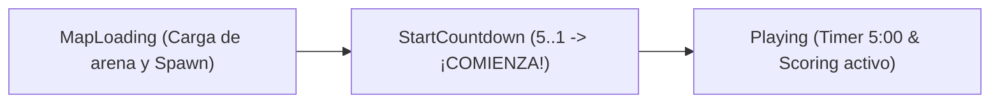
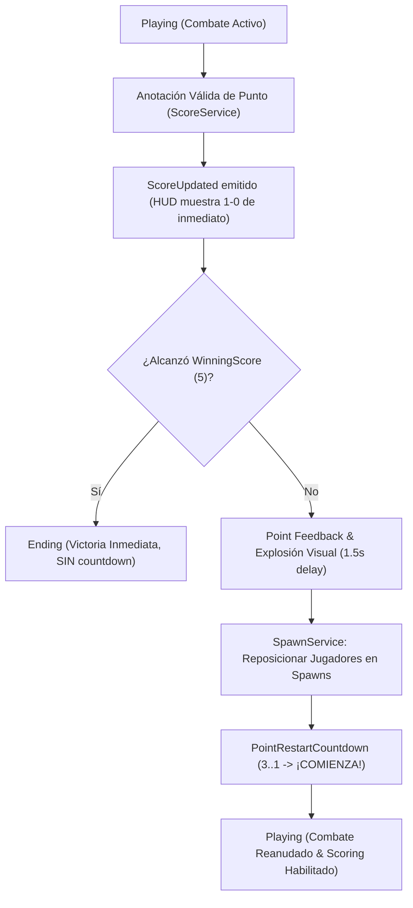

# Slap Duels 2.0 — MATCH_FLOW

> Este documento conserva contenido del `GAME_SDD.md` original suministrado, redistribuido por dominio para reducir el contexto necesario para agentes de IA.

## 10. Start Countdown (Conteo de Inicio Pre-Partida)

### 10.1 Propósito y Filosofía
El estado `StartCountdown` introduce una transición breve, clara y tensa una vez que la arena ha sido instanciada y los jugadores han sido posicionados en sus respectivos spawns (`RedSpawn` y `BlueSpawn`), evitando que la partida arranque abruptamente sin preparación visual y espacial para los contendientes.



### 10.2 Configuración Independiente
- Definido en `Config.Match.StartCountdownTime = 5`.
- **Independiente de `Config.Round.MatchCountdownTime`:**
  - `MatchCountdownTime`: Countdown de matchmaking / preparación en lobby.
  - `StartCountdownTime`: Countdown en la arena inmediatamente previo a `Playing`.

### 10.3 Reglas Fundamentales de Ejecución
1. **Posicionamiento Previo:** Los jugadores ya se encuentran en `RedSpawn` y `BlueSpawn` antes de que comience el countdown (`SpawnService:SpawnMatchPlayers` se ejecuta en `MapLoading`).
2. **Timer de Partida Congelado:** El timer de 5 minutos (`RoundDuration = 300`) **NO corre ni disminuye** durante `StartCountdown`. `session.StartTime = os.clock()` se registra estrictamente en el instante de transición a `Playing`.
3. **Scoring Inactivo:** `ScoreService:StartScoring(session)` no se ejecuta durante `StartCountdown`. Las zonas de victoria (`RedWin` y `BlueWin`) rechazan activaciones (`_validateScorer` exige `currentState == Constants.RoundState.Playing`).
4. **Emisión Autoritativa del Servidor:**
   - Durante cada segundo (5, 4, 3, 2, 1), `RoundService` emite el remote `Remotes.Match.Countdown` con payload `{ MatchId = session.Id, Value = t, Started = false }`.
   - Al finalizar, emite la señal de inicio ("GO") con `{ MatchId = session.Id, Value = 0, Started = true }`.
5. **Transición a Playing:** Inmediatamente tras emitir el valor 0, la partida pasa a `Constants.RoundState.Playing`.

### 10.4 Manejo de Desconexiones y Cancelación
- Si un jugador se desconecta durante `StartCountdown`:
  - `RoundService:_handlePlayerLeaving` detecta el estado `StartCountdown` e invoca `_cancelSession("PlayerDisconnected")`.
  - El hilo `_sessionThread` se cancela de forma inmediata (`pcall(task.cancel)`), interrumpiendo cualquier bucle de espera.
  - Se retornan los jugadores restantes al lobby, se destruye la arena en `MatchInstanceService` y el estado vuelve a `Waiting`.
  - Nunca se transiciona a `Playing` ni se inician servicios de scoring para una sesión cancelada.

### 10.5 Presentación Visual (`MatchHUD.StartCountdownFrame`)
- Integrado de forma nativa en `StarterGui.MatchHUD`:
  - `StartCountdownFrame`: Contenedor centrado con esquinas redondeadas (`UICorner`), borde iluminado (`UIStroke`) y degradado moderno (`UIGradient`).
  - `Title`: Etiqueta con texto `"LA PARTIDA COMIENZA"`.
  - `CountdownLabel`: Texto dinámico con fuente `GothamBlack`.
- Animaciones gestionadas por `MatchController`:
  - Cada número (`5 → 4 → 3 → 2 → 1`) genera una micro-animación de escala (`TextSize` de 84 a 72) con `TweenService`.
  - Al emitirse `0` / `Started = true`, el texto cambia a `"¡COMIENZA!"` en color verde vibrante (`Color3.fromRGB(90, 230, 110)`) con animación de impacto más destacada, ocultando el marco de forma fluida antes de revelar el timer normal de partida.

### 10.6 Match Start Presentation / Game Feel (Controlador de Efectos Cliente)
- **Controlador Dedicado:** `src/client/Controllers/MatchStartEffectsController.luau`.
- **Naturaleza Arquitectónica:** Responsabilidad exclusiva de **presentación en cliente**. No participa de la autoridad del servidor ni modifica las reglas de la partida ni la máquina de estados.
- **Sincronización Autoritativa:** Escucha el evento existente `Remotes.Match.Countdown` con label `"START_COUNTDOWN"`. El cliente reacciona en tiempo real a cada emisión del servidor sin adelantar conteos locales (`wait(1)`).
- **Aislamiento por MatchId:** Todo evento valida `extraData.MatchId` contra el match activo del cliente local, asegurando independencia total entre partidas concurrentes (1v1, 2v2 o 3v3).
- **Componentes y Efectos Integrados:**
  1. **Camera Shake Local:**
     - Enlazado con `RunService:BindToRenderStep` (`RenderPriority.Camera.Value + 1`).
     - Modela trauma decreciente cuadrático sin alterar permanentemente el CFrame base de la cámara (cero drift).
     - Desplazamiento dinámico en studs y rotación angular suave controlada por `math.noise`.
  2. **Screen Flash (`MatchHUD.StartEffects.FlashOverlay`):**
     - Destello blanco instantáneo que atenúa rápidamente hacia transparencia 1 mediante `TweenService`.
     - Intensidad creciente desde `0.90` (sutil en 5) hasta `0.18` (destello cegador en ¡COMIENZA!).
  3. **Blur Dinámico (`Lighting.MatchStartBlur`):**
     - Desenfoque efímero en `Lighting` que sube de 0 al tamaño objetivo (`Size` 2 en 5 hasta 10 en ¡COMIENZA!) y desvanece de inmediato.
  4. **Pulse & Shockwave (`MatchHUD.StartEffects.PulseFrame` / `ShockwaveFrame`):**
     - Anillos circulares con `UIStroke` que se expanden hacia afuera y desvanecen simulando ondas expansivas.
  5. **Audio Feedback (`SoundService.MatchStartSFX`):**
     - Dispara sonidos reales y editables: `CountdownTick` (5..3), `CountdownHeavy` (2), `CountdownFinal` (1), y combinación explosiva `StartWhoosh` + `StartImpact` en ¡COMIENZA!.
- **Perfiles de Intensidad Configurables (`Config.StartCountdownEffects`):**
  - Centralizados en `src/shared/Config.luau` con parámetros para studs de sacudida, grados de rotación, duración, transparencias, blur, escalas y volúmenes para tuning continuo.
- **Política de Limpieza (Cleanup):**
  - Cancelación inmediata de todos los tweens, hilos y sacudida de cámara ante desconexión, abandono, fin de partida (`Ending`, `ReturningToLobby`, `Waiting`) o tras la culminación del clímax al pasar a `Playing`.
  - Garantiza que `BlurEffect.Enabled = false`, `Blur.Size = 0` y `FlashOverlay.BackgroundTransparency = 1` sin residuos visuales en pantalla.

---

### 10.7 Point Restart Countdown (Reinicio Autoritativo de Punto - 3 Segundos)

#### Objetivo y Flujo
Tras la anotación válida de un punto (ej. Red 1 - 0 Blue), la partida no continúa de inmediato. Se ejecuta un countdown de 3 segundos (`3 → 2 → 1 → ¡COMIENZA!`) con reposicionamiento de jugadores y Game Feel cinematográfico antes de retomar `Playing`.



#### Reglas de Ejecución y Autoridad del Servidor
1. **Diferenciación de Estados:**
   - `StartCountdown` (5 segundos): Ocurre una única vez al inicio formal de la partida tras cargar la arena.
   - `PointRestartCountdown` (3 segundos): Estado intermedio tras cada punto anotado antes de que algún equipo alcance `WinningScore`.
2. **Pausa y Preservación del Timer:**
   - El countdown de 3 segundos actúa como una pausa entre puntos.
   - **`session.StartTime` NO se reinicia** tras un punto. Permanece fijado desde el inicio original del match.
   - **`RoundDuration` (5:00) NO se altera ni se incrementa artificialmente**. El decremento del tiempo de combate se suspende durante el countdown y se reanuda de manera continua al regresar a `Playing`.
   - Si el timer llega a `0` durante `Playing`, el ganador se determina de inmediato por `ScoreService:GetWinner` y la partida transiciona a `Ending` sin iniciar ningún countdown.
3. **Punto Final / WinningScore:**
   - Si un equipo alcanza `WinningScore = 5` (o en un eventual 5 - 4), la partida transiciona **inmediatamente** a `Ending` declarando la victoria. **NO se inicia el countdown de 3 segundos**.
4. **Bloqueo Autoritativo de Scoring:**
   - Durante `PointRestartCountdown`, el scoring se encuentra completamente deshabilitado en dos capas:
     - Atómica en `ScoreService`: `_pointInProgress[matchId] = true`.
     - Validación de estado: `_validateScorer` y `_checkSpatialScoring` verifican estrictamente `currentState == Constants.RoundState.Playing`.
   - Es imposible marcar anotaciones consecutivas o acumular dobles puntos durante la pausa o el countdown.
5. **Reposicionamiento Físico:**
   - Antes de iniciar el conteo de 3 segundos, `RoundService` invoca `SpawnService:SpawnMatchPlayers(session)` para teleportar y estabilizar a los jugadores en los spawns de la arena activa.
   - `ScoreService:ResetZonePresences(matchId)` limpia cualquier registro previo de contacto físico con las zonas.
6. **Manejo de Desconexiones:**
   - Si un jugador abandona durante `PointRestartCountdown`, `RoundService:_handlePlayerLeaving` lo detecta, cancela el hilo `_pointRestartThread`, declara ganador al oponente restante y pasa a `Ending` con cleanup exhaustivo.

#### Contrato de Remote y Sincronización
- Reutiliza el evento `Remotes.Match.Countdown` extendido con el campo tipado `Phase`:
  ```luau
  {
      MatchId = session.Id,
      Value = 3, -- 3, 2, 1, 0
      Started = false, -- true en 0 ("¡COMIENZA!")
      Phase = "PointRestart", -- o "MatchStart"
  }
  ```

---

### 10.8 UI Real y Editable en StarterGui.MatchHUD

Toda la presentación visual del countdown y sus efectos existe como **Instances reales y editables directamente desde Roblox Studio**, sin construcción de UI por código. El código cliente manipula exclusivamente propiedades dinámicas (visibilidad, transparencia temporal y escala animada).

#### Estructura en StarterGui
```text
StarterGui
└── MatchHUD
    ├── StartCountdownFrame
    │   ├── Title
    │   ├── CountdownLabel
    │   │   ├── Shadow3D (Capa de relieve y extrusión 3D)
    │   │   └── UIGradient (Brillo y biselado)
    │   ├── UIScale
    │   ├── StartNumberHere (Marcador visual de origen del salto)
    │   └── EndNumberHere (Marcador visual de destino del salto)
    │
    └── StartEffects (Frame, Size=1,1, BackgroundTransparency=1)
        ├── FlashOverlay (Frame blanco, BackgroundTransparency=1)
        ├── PulseFrame (Frame centrado, BackgroundTransparency=1)
        │   ├── UIStroke
        │   └── UIScale
        ├── ShockwaveFrame (Frame centrado, BackgroundTransparency=1)
        │   ├── UIStroke
        │   └── UIScale
        └── UIScale
```

#### Regla de Editabilidad
- Colores (`BackgroundColor3`, `TextColor3`, `UIStroke.Color`), fuentes (`Font`), tamaños base (`TextSize`, `Size`), posiciones (`Position`, `AnchorPoint`), bordes (`Thickness`) y degradados (`UIGradient`) se configuran visualmente en Studio.
- El HUD scoreboard (`RedTeamFrame`, `BlueTeamFrame`) y el timer (`MatchTimerFrame`) se mantienen visibles en pantalla durante `PointRestartCountdown`, mientras que el score actualizado (`ScoreUpdated`) se refleja antes de que inicie la cuenta regresiva.

#### Animación en Curva "C" (Salto Parabólico y Rebote)
- **Marcadores de Referencia:** `StartNumberHere` (esquina superior derecha) y `EndNumberHere` (centro de pantalla) determinan la trayectoria de forma 100% editable desde Studio.
- **Trayectoria en Arco / Onda "C":** Se interpola la posición mediante una curva de Bézier cuadrática que abre hacia la derecha y barre por debajo antes de curvar hacia el centro.
- **Relieve 3D Chiseled:** `CountdownLabel` cuenta con una capa inferior `Shadow3D` desplazada con trazo oscuro y degradado vertical, logrando profundidad y volumen tridimensional.
- **Ciclo Secuencial ("Entra un número, rebota, se va, entra el siguiente"):**
  1. **Aparición:** El número nace en `StartNumberHere` con escala pequeña (`0.35`), inclinación de rotación (`24°`) y transparencia.
  2. **Vuelo:** Desciende y curva hacia la izquierda agrandándose hasta `1.28` mientras rota hacia `-8°`.
  3. **Aterrizaje con Rebote (Bounce):** Impacta en `EndNumberHere`, la escala rebota elásticamente (`1.30 → 1.00` con `Back.Out`) y la rotación se estabiliza en `0°`.
  4. **Pausa de Lectura:** Se mantiene nítido en el centro durante ~0.32 segundos.
  5. **Salida Dinámica:** Continúa su impulso hacia abajo-izquierda desvaneciéndose antes de la llegada del próximo número.
  6. **Clímax en ¡COMIENZA!:** Aterriza directamente en el centro con la máxima escala expansiva, destello y ondas de choque.

#### Perfiles de Game Feel (`Config.PointRestartCountdownEffects`)
- Optimizado para ser más ágil e intenso que el inicio de la partida:
  - **3:** Sacudida media (`0.25 studs`, `1.0°`), flash leve (`0.80`), blur (`3.5`), sonido `CountdownTick`.
  - **2:** Sacudida fuerte (`0.40 studs`, `1.5°`), flash medio (`0.65`), blur (`5.0`), sonido `CountdownHeavy`.
  - **1:** Sacudida muy fuerte (`0.55 studs`, `2.0°`), flash intenso (`0.50`), blur (`7.0`), sonido `CountdownFinal`.
  - **¡COMIENZA!:** Clímax rápido (`0.85 studs`, `2.8°`), destello principal (`0.20`), blur (`9.0`), onda expansiva `Shockwave`, combinación `StartWhoosh` + `StartImpact`.

---
