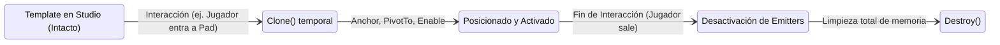

# Slap Duels 2.0 — ASSETS

> Este documento conserva contenido del `GAME_SDD.md` original suministrado, redistribuido por dominio para reducir el contexto necesario para agentes de IA.

## 3. Regla Fundamental de Assets

**Los assets permanentes de presentación DEBEN crearse y editarse directamente en Roblox Studio.**

Esto incluye de forma obligatoria:
- `Sound` (efectos de sonido, música, locuciones)
- `ParticleEmitter` (chispas, ondas, auras, fuegos, explosiones)
- `Attachment` (puntos de anclaje de efectos)
- `Part` y `MeshPart` utilizados como VFX o proyectiles
- `Trail` y `Beam`
- Elementos de Interfaz de Usuario (`ScreenGui`, `Frame`, `TextLabel`, `ImageLabel`, etc.)
- Modelos visuales y mapas de juego

> [!CAUTION]
> **PROHIBIDO:** Crear permanentemente estos assets mediante código utilizando `Instance.new()` cuando puedan existir como recursos editables dentro del proyecto. El código Luau tiene como único rol **controlar, clonar, posicionar, activar y destruir instancias temporales de los assets existentes**. La apariencia visual, texturas, colores, curvas de tamaño y tasas de emisión deben permanecer editables en Studio por diseñadores y artistas.

---

## 4. Distinción: Template vs Instance

Para cualquier efecto o recurso audiovisual, se debe mantener una separación estricta:

- **ASSET TEMPLATE:** Recurso visual permanente almacenado en Studio (ej. dentro de `Folder` de efectos o `ReplicatedStorage`). Diseñado manualmente. **NUNCA debe modificarse en tiempo de ejecución ni destruirse.**
- **INSTANCE (Clon Temporal):** Copia generada en tiempo de ejecución mediante `:Clone()` para ser utilizada durante una interacción específica.

### Ciclo de Vida de una Instancia de Efecto

---
